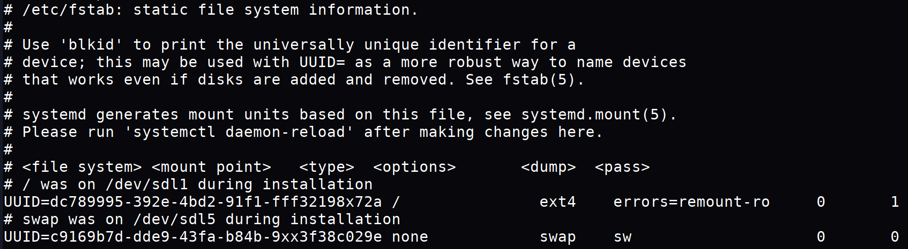

# Base-Knowledge

- [Base-Knowledge](#base-knowledge)
  - [Terminal](#terminal)
  - [Acronyms](#acronyms)
  - [Filesystem](#filesystem)
    - [Files](#files)
    - [Directories](#directories)
    - [Permissions](#permissions)
      - [Permission examples](#permission-examples)
  - [fstab](#fstab)

## Terminal

when you see a `$` in your terminal or in instructions for a command it means user
when you see a `#` in your terminal or in instructions for a command it means root

- examples

  ```txt
  Normal User
  $ ls
  Root User
  # ls
  equivalent to 
  sudo ls
  ```

## Acronyms

| Acronyms | Meaning |
| -------- | ------- |
| GUI   | Command Line Interface |
| CLI   | Graphical User Interface |
| TUI   | Terminal User Interface |
| WM/DE | Window Manager/Display Environment |
| uid   | User ID |
| gid   | Group ID |
| pid   | Process ID |
| ide   | Integrated development environment |
| posix | Portable Operating System Interface |
| utf   | Unicode Transformation Format |
| dir   | Directories |
| | Below this is a work in progress |
| fsf   | Free Software Foundation | <!-- I don't know if this is necessary -->
| CUPS  | Common UNIX Printing System | <!-- I don't know if this is necessary -->
| tty   | Teletypewriter | <!-- I don't know if this is Right -->
| gnu   | gnu's not unix | <!-- I don't know if this is necessary -->
| pgp   | Pretty Good Privacy | <!-- I think these belong in encrypting tab -->
| gpg   | GNU Privacy Guard | <!-- I think these belong in encrypting tab -->
| GPL   | General Public License | <!-- I think i should make a license section -->

## Filesystem

- [Filesystem Hierarchy Standard](https://en.wikipedia.org/wiki/Filesystem_Hierarchy_Standard)

### Files

- Everything in linux is a file [wikipedia article](https://en.wikipedia.org/wiki/Everything_is_a_file)

### Directories

- A directory is a location for storing files

- Shortcuts

  ```bash
  /    # Root Dir
  ~/   # Home Dir
  -/   # Back to previous Dir
  ./   # Current Dir
  ../  # Up 1 Dir
  ```

### Permissions

- To open a directory you must have read execute permission
- To runs a program it must have execute permission

|   | Symbolic | Permission |
| - | :------: | :--------- |
| 7 | rwx | read, write, execute |
| 6 | rw- | read, write |
| 5 | r-x | read, execute |
| 4 | r-- | read only |
| 3 | -wx | write, execute |
| 2 | -w- | write only |
| 1 | --x | execute only |
| 0 | --- | None |

#### Permission examples

| Numeric | owner | group | everyone |
| :-----: | :---: | :---: | :------: |
| 777 | rwx | rwx | rwx |
| 770 | rwx | rwx | --- |
| 700 | rwx | --- | --- |
| 000 | --- | --- | --- |
| 744 | rwx | r-- | r-- |
| 775 | rwx | rwx | r-x |
| 444 | r-- | r-- | r-- |

## [fstab](http://manpages.ubuntu.com/manpages/jammy/en/man5/fstab.5.html)

fstab is a file in /etc that stores the information
about your systems filesystems.
Its also what mounts your drives on boot

example

