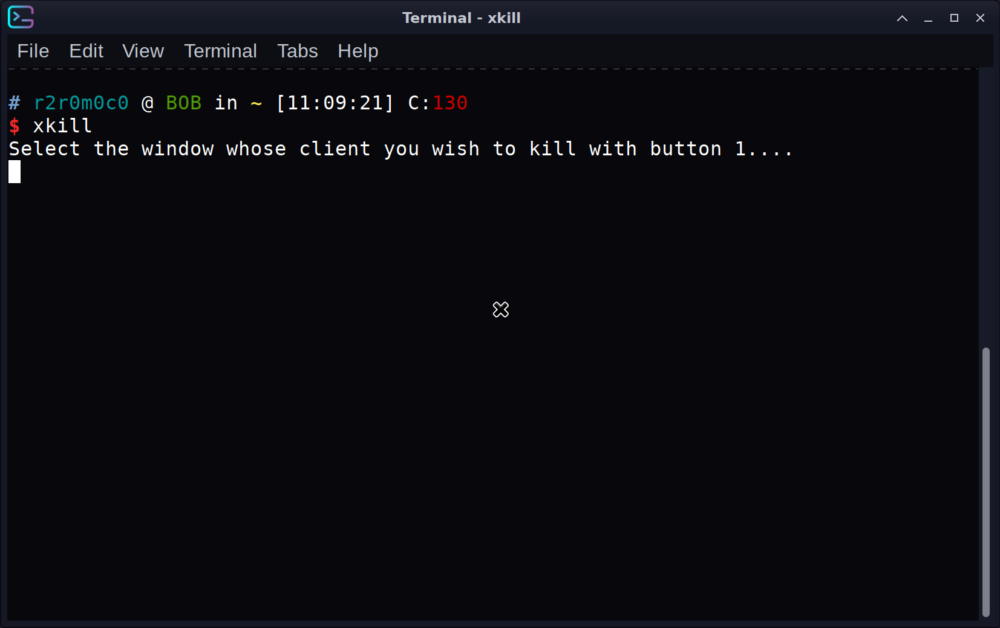

# Processes

- ## [htop](http://manpages.ubuntu.com/manpages/jammy/en/man1/htop.1.html)

  - usage `htop`
  - example
  

  - alternatives
    - [btop](https://github.com/aristocratos/btop) is very similar to htop in what it displays to htop it just looks a bit nicer and is written in c++

- ## [kill](http://manpages.ubuntu.com/manpages/jammy/en/man1/kill.1.html)

  -
  - usage `kill` process id
  - example

    ```bash
    kill 882
    ```

- ## [xkill](http://manpages.ubuntu.com/manpages/jammy/en/man1/xkill.1.html)

  - usage `xkill`
  - example
  
